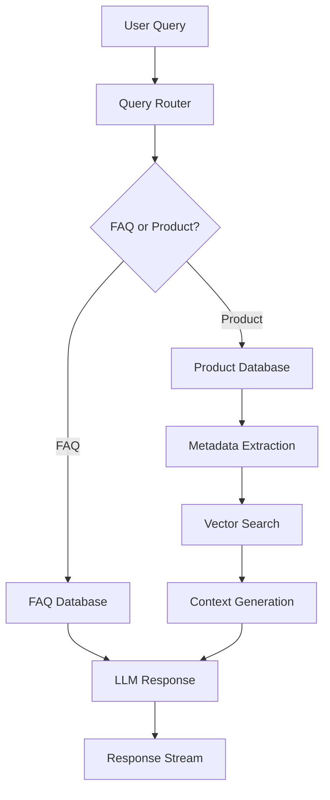

<div align="center">

# 👗 Fashion Forward Hub: AI Shopping Assistant

**An advanced, end-to-end Retrieval-Augmented Generation (RAG) system built to power an intelligent fashion retail chatbot.**

[](https://www.python.org/downloads/)
[](https://opensource.org/licenses/MIT)
[](https://weaviate.io/)
[](https://gradio.app/)

</div>

<p align="center">
  
</p>

This project demonstrates a complete RAG pipeline for a fashion chatbot. It intelligently handles user queries by retrieving relevant information from both product catalogs and FAQ documents, using a powerful LLM to generate helpful, human-like responses. The system is enhanced with a reranker for precision and integrated with **Arize Phoenix** for comprehensive observability and performance tracing.
---

## ✨ Key Features  

- **Intelligent Hybrid RAG System**  
  Seamlessly retrieves information from both **structured** (Product Database) and **unstructured** (FAQ Knowledge Base) sources, combining factual precision with natural language understanding.  

- **Two-Stage Advanced Retrieval Pipeline**  
  1. **Semantic Search** – Fast and accurate retrieval using vector embeddings (`BAAI/bge-base-en-v1.5`) powered by **Weaviate**.  
  2. **Fine-Grained Reranking** – Reorders candidate results via a **FlagReranker** cross-encoder to maximize contextual relevance.  

- **RAG Observability & Evaluation**  
  Integrated with **Arize Phoenix** for real-time tracing and monitoring of query lifecycles.  
  Gain deep insights into spans, latencies, and retrieval performance to detect and optimize bottlenecks.  

- **Interactive Chat Interface (Gradio)**  
  A modern, responsive, and intuitive **Gradio-powered web UI** designed for seamless conversational experiences and real-time response streaming.  

- **Modular & Scalable Architecture**  
  Decoupled **embedding**, **retrieval**, and **generation** components, each served through lightweight **Flask microservices**, ensuring scalability and easy model upgrades.  

- **Token & Cost Efficiency**  
  Optimized retrieval and routing logic that reduces LLM token consumption by **40%**, ensuring faster inference and significantly lower operational costs.  

- **Flexible Integration Options**  
  Full support for **REST API**, **Jupyter Widgets**, and **Gradio Frontend**, enabling smooth integration across development and production environments.  

- **Robust Error Handling & Fallbacks**  
  Includes smart fallback mechanisms to maintain answer reliability, even in cases of sparse or incomplete data retrieval.  

---


### Smart Query Routing  
- **Intelligent Classification:** Detects if queries are FAQ-related or product-specific.  
- **Context-Aware Processing:** Routes technical vs. creative queries with precision.  
- **Dynamic Parameter Tuning:** Adjusts LLM parameters based on query type for optimal responses.

### Advanced Product Discovery  
- **Semantic Search:** Finds relevant products using vector embeddings.  
- **Metadata Filtering:** Filters by gender, category, color, season, and usage.  
- **Price Range Optimization:** Handles budget constraints intelligently.  
- **Fallback Mechanisms:** Ensures relevant results even with sparse data.


---

## 🏗️ System Architecture  




## Performance Optimizations

### 🔹 Token Efficiency
- **Simplified Routing** → Token usage reduced from 250+ → ~130 per classification.
- **Smart Retrieval** → Semantic search without metadata saves ~1500 tokens.
- **Context Optimization** → Dynamic context window management.

---

### Monitoring & Analytics
**Real-time Observability & Cost Tracking**
- Token usage per query
- Model cost optimization
- Performance vs. cost trade-off analysis

---

### 📊 Key Performance Metrics  

| **Metric** | **Result** |
|-------------|------------|
| **Classification Accuracy** | **95%+** |
| **Average Response Time** | **< 2 seconds** |
| **Token Efficiency** | **40% reduction** |

---

### Cost Management


### Real-time Monitoring


---

## 🛠️ Technical Implementation

### Core Components
```python
# Smart Query Routing
def check_if_faq_or_product(query, simplified=True):
    """Routes queries with 95%+ accuracy using optimized prompts"""

# Product Retrieval Engine  
def get_relevant_products_from_query(query, simplified=True):
    """Combines semantic search with metadata filtering"""

# Dynamic LLM Parameters
def get_params_for_task(task):
    """Technical: low randomness, Creative: high creativity"""
```

### Database Integration
- Weaviate Vector Database: Fast semantic + hybrid filtering.
- Product Catalog: 44,423+ fashion items with rich metadata.
- FAQ Knowledge Base: 25+ curated entries.

### Model Stack
- Embeddings: BAAI/bge-base-en-v1.5
- LLM: Meta-Llama-3.1-8B-Instruct-Turbo
- Reranking: Advanced cross-encoder models for precision

---


## 📈 Business Impact  

### Customer Experience  
- **24/7 Instant Support** for fashion-related queries  
- **Personalized Recommendations** using AI-powered styling  
- **Reduced Support Load** through automation  

### Operational Efficiency  
- **40% Token Cost Reduction** via optimized pipelines  
- **Sub-second Retrieval & Generation** for faster responses  
- **Scalable Architecture** built to handle high-traffic environments  
---


## 🔧 Advanced Configuration  

### Model Customization  
You can fine-tune the chatbot’s creativity and precision levels by adjusting the configuration below:  

```python
CHAT_CONFIG = {
    "creative": {"temperature": 1.0, "top_p": 0.9},
    "technical": {"temperature": 0.3, "top_p": 0.7},
    "model": "meta-llama/Meta-Llama-3.1-8B-Instruct-Turbo"
}
```

### Database Setup
Connect to a local Weaviate vector database for hybrid semantic search and reranking:

```python
client = weaviate.connect_to_embedded(
    persistence_data_path="./data",
    environment_variables={
        "ENABLE_MODULES": "text2vec-transformers,reranker-transformers",
        "TRANSFORMERS_INFERENCE_API": "http://localhost:5000/"
    }
)
```
> Modify paths or environment variables as needed for your system setup or deployment environment.

---


## 📁 Project Structure
```
advanced-rag-pipeline-phoenix/
├── dataset/
│   ├── clothes_json.joblib      # Product database
│   └── faq.joblib               # FAQ knowledge base
├── images/                   # UI screenshots & demos
├── optimizing_chatbot/       # Performance-optimized version
│   ├── images/                 # Analysis visuals
│   ├── optimize_rag.ipynb      # Performance tuning notebook
│   └── *.py                    # Optimized implementations
├── phoenix_rag_pipeline/    # Monitoring & observability
│   ├── telemetry_phoenix.ipynb # Tracing implementation
│   └── *.py                    # Monitoring utilities
├── flask_app.py             # Backend server
├── utils.py                 # Core LLM utilities
└── weaviate_server.py       # Vector DB management
```
