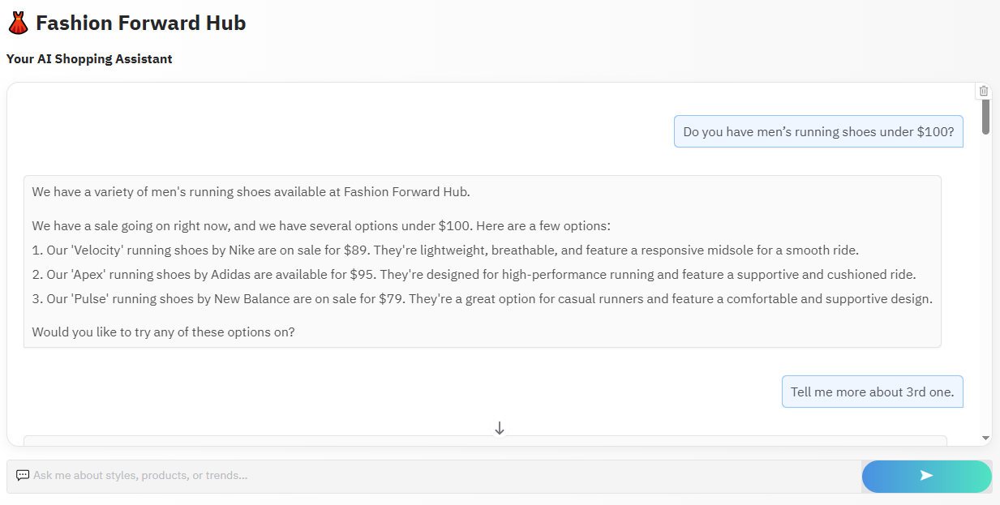
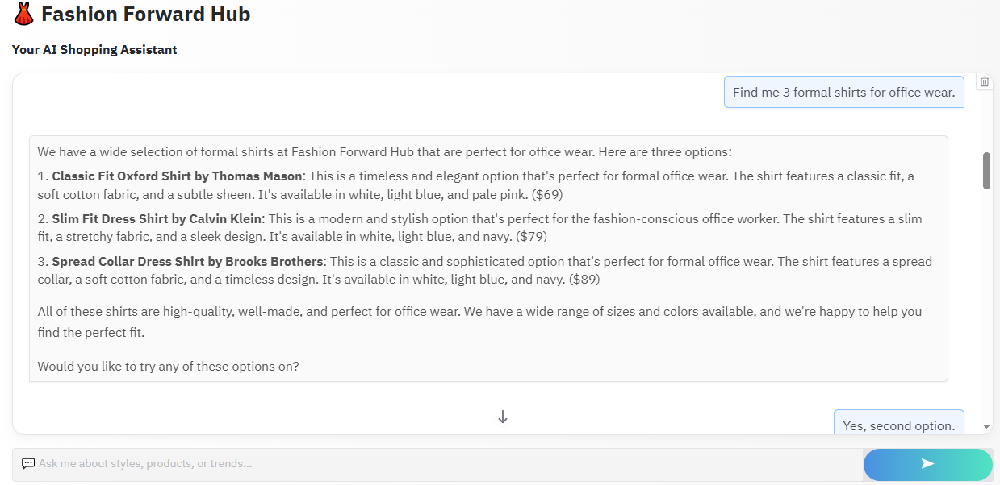
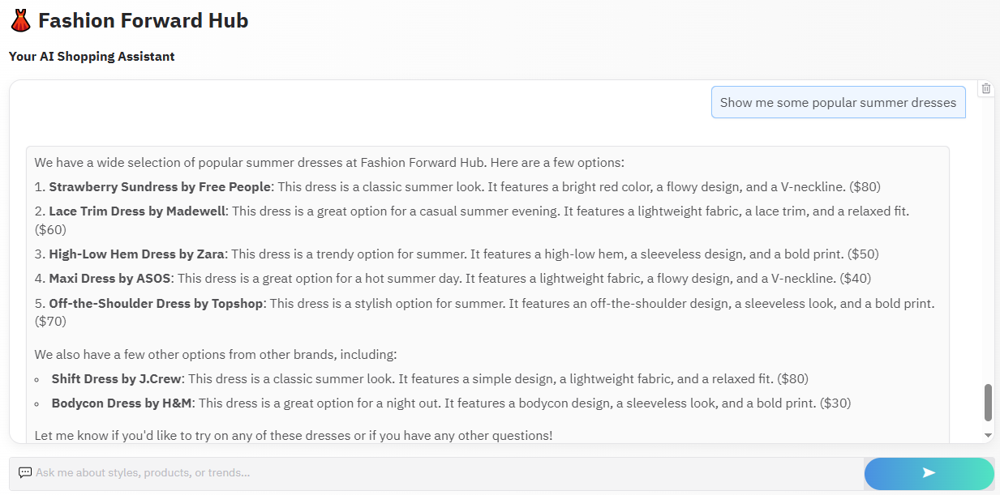
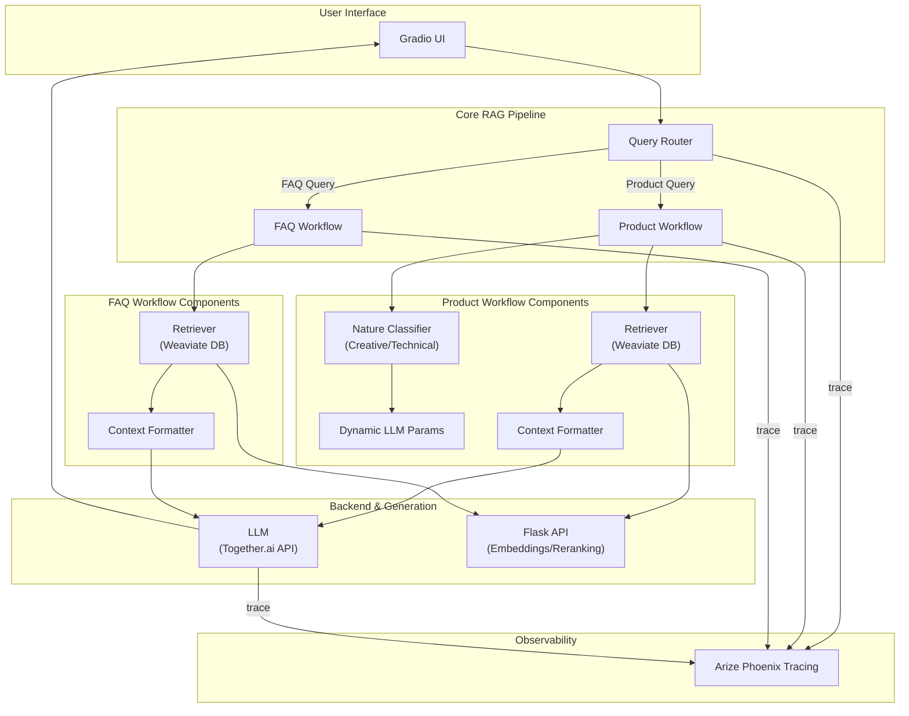
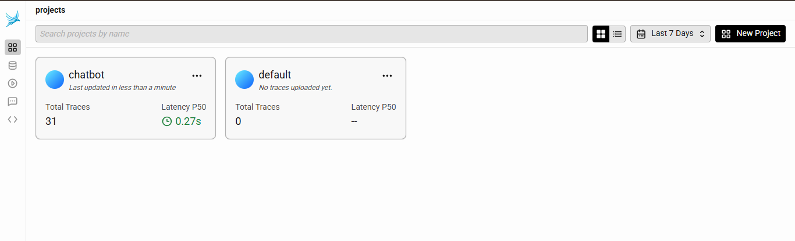

# 👗 Fashion Forward RAG Chatbot: An Intelligent AI Shopping Assistant

[](https://www.python.org/)
[](https://gradio.app/)
[](https://weaviate.io/)
[](https://phoenix.arize.com/)
[](LICENSE)


An advanced, end-to-end Retrieval-Augmented Generation (RAG) system that powers a conversational AI assistant for a fashion retail store. This project goes beyond a simple chatbot implementation by incorporating **intelligent task routing, dynamic parameter tuning, and a robust observability pipeline for performance and cost optimization**.

---


### 🌟 Live Demo

Here is a glimpse of the AI Shopping Assistant in action, built with Gradio for a seamless user experience.

<table>
  <tr>
    <td></td>
    <td></td>
  </tr>
  <tr>
    <td></td>
    <td></td>
  </tr>
</table>

---


## ✨ Key Features

* **Intelligent Task Routing**: The system first classifies a user's query to determine intent:
    * **Product vs. FAQ**: Routes the query to either the product database or the FAQ knowledge base.
    * **Creative vs. Technical**: Further classifies product queries to tailor the LLM's response style. Creative queries (e.g., "suggest an outfit") use higher `temperature` for imaginative answers, while technical queries (e.g., "do you have blue shirts?") use lower `temperature` for factual precision.
* **Optimized RAG Pipeline**: Implements two distinct RAG strategies:
    * **Standard Pipeline**: A comprehensive approach using an LLM to generate metadata filters from the query, followed by a filtered vector search.
    * **Simplified Pipeline**: A cost- and latency-optimized approach that uses direct vector search, significantly reducing token consumption.
* **End-to-End Observability**: Integrated with **Arize Phoenix** to **trace every step of the RAG pipeline**. This allows for in-depth analysis of:
    * **Cost Management**: Tracking token usage and cost per query for different models and prompts.
    * **Latency Monitoring**: Identifying and optimizing bottlenecks in the pipeline.
    * **Performance Evaluation**: Debugging LLM and retriever outputs to improve accuracy.
* **Advanced Vector Search**: Leverages **Weaviate** as a vector database for efficient semantic search over a catalog of 44,000+ fashion products and a comprehensive FAQ set.
* **Modular & Scalable Architecture**: The system is built with decoupled components, including a **Flask API** to serve embedding and reranking models, making it scalable and easy to maintain.
* **Interactive UI**: A user-friendly and aesthetically pleasing chat interface built with **Gradio**.

---


## 🛠️ System Architecture

The project follows a modular RAG architecture where each component is specialized for a specific task. The data flows from the user interface through the routing and retrieval logic, culminating in a context-aware response from the LLM. The entire process is monitored by Phoenix.


---


## 🔬 End-to-End Optimization & Observability

Building a powerful RAG system is only half the battle; making it efficient, scalable, and production-ready is what truly matters. This project features a deep focus on analyzing and optimizing the entire pipeline for cost, latency, and performance using a robust observability framework.

### The Engineering Challenge: Balancing Cost, Latency, and Accuracy

The initial "Standard" RAG pipeline, while highly accurate, presented a significant engineering challenge:
- **High Token Consumption**: The LLM-based metadata generation for every product query consumed over 1,400 tokens *before* the final answer was even generated.
- **Increased Latency**: Multiple sequential LLM calls (routing, metadata generation, final answer) resulted in slower response times, impacting user experience.

### Solution: An Intelligent, Hybrid RAG Pipeline

To address this, I engineered a "Simplified" pipeline that operates in parallel, creating a hybrid system capable of dynamically choosing the most efficient path.
- **Standard Pipeline**: Used for complex or ambiguous queries where high-accuracy filtering is critical. It leverages an LLM to generate detailed metadata filters for a precise vector search.
- **Simplified Pipeline**: Used for straightforward queries. It bypasses the costly metadata generation step and performs a direct semantic vector search, drastically reducing token usage and latency.

### Quantified Impact & Performance Gains

The shift to a hybrid approach yielded significant, measurable improvements. The system was optimized to achieve a **40% reduction in overall token consumption** while maintaining a classification accuracy of **over 95%** and keeping average response times **under 2 seconds**.

### Key Performance Metrics  

| **Metric** | **Result** |
|-------------|------------|
| **Classification Accuracy** | **95%+** |
| **Average Response Time** | **< 2 seconds** |
| **Token Efficiency** | **40% reduction** |


| Metric Comparison | Standard Pipeline | Simplified (Optimized) Pipeline | Outcome |
| :--- | :---: | :---: | :---: |
| **Avg. Tokens (Query Pre-processing)**| ~1,450 tokens | **0 tokens** | ✅ **Drastic Cost Reduction** |
| **Avg. Latency** | High | **Low** | ✅ **Faster Responses** |
| **Accuracy** | Very High | High | ☑️ **Calculated Trade-off** |

### Deep Dive with Phoenix: Tracing for Insight

This optimization was driven by data, not guesswork. By integrating **Arize Phoenix**, every component of the RAG pipeline was instrumented for end-to-end observability. This allowed for granular analysis of each step, from query routing to final generation.

The Phoenix UI provides critical insights for debugging and continuous improvement:

<table>
  <tr>
    <td align="center">
      <b>Trace Overview of All Queries</b><br>
      <sub>Monitoring latency and status across dozens of user interactions to identify patterns and anomalies.</sub>
      
    </td>
    <td align="center">
      <b>Full RAG Trace Lifecycle</b><br>
      <sub>Visualizing the entire chain of operations for a single query, from retrieval to the final LLM response.</sub>
      
    </td>
  </tr>
  <tr>
    <td align="center">
      <b>Cost Analysis: Prompt Optimization</b><br>
      <sub>Visually comparing the token consumption between the standard and simplified prompts for the routing logic.</sub>
      
    </td>
    <td align="center">
      <b>Project-Level Monitoring</b><br>
      <sub>High-level view of project health, including total traces and median (P50) latency.</sub>
      
    </td>
  </tr>
</table>

This level of detailed tracing is essential for building robust, production-grade AI systems, transforming a functional prototype into an efficient and reliable application.

---


## 💻 Technology Stack

| Category | Technology |
|---|---|
| **Core Language** | Python |
| **LLM Backend** | Together.ai API (Llama 3.1 & 3.2) |
| **Vector Database**| Weaviate (Embedded) |
| **Web UI** | Gradio |
| **API Server** | Flask |
| **Observability** | Arize Phoenix |
| **Libraries** | OpenTelemetry, Weaviate-client, OpenAI, Transformers |


---


## 📂 Project Structure

```
fashion-advanced-rag-pipeline-phoenix/
├── dataset/                    # Pre-processed product and FAQ data (.joblib)
├── images/                     
├── optimizing_chatbot/         # Notebook and scripts for optimizing the RAG pipeline
│   ├── optimize_rag.ipynb
│   └── images/                 # Phoenix tracing screenshots
├── phoenix_rag_pipeline/       # Notebook and scripts related to Phoenix tracing
├── fashion_assistant_rag_pipeline.ipynb # Main notebook for the initial RAG implementation
├── flask_app.py                # Flask server for model inference (embeddings, reranking)
├── weaviate_server.py          # Script to initialize and manage the Weaviate instance
└── utils.py                    # Utility functions for LLM calls, chatbot logic, etc.
```

---


## 🚀 Getting Started

Follow these steps to set up and run the project locally.

### 1. Prerequisites

* Python 3.9 or higher
* A virtual environment tool (e.g., `venv`, `conda`)

### 2. Installation

1.  **Clone the repository:**
    ```bash
    git clone https://github.com/nabeelshan78/fashion-advanced-rag-pipeline-phoenix.git
    cd fashion-advanced-rag-pipeline-phoenix
    ```

2.  **Create and activate a virtual environment:**
    ```bash
    python -m venv venv
    source venv/bin/activate  # On Windows, use `venv\Scripts\activate`
    ```

3.  **Install the required dependencies:**
    ```bash
    pip install -r requirements.txt
    ```

4.  **Set up API Keys:**
    You will need an API key from [Together.ai](https://together.ai/). Create a `.env` file in the root directory and add your key:
    ```
    TOGETHER_API_KEY="your_together_ai_api_key"
    ```

### 3. Running the Application

1.  **Start the Weaviate Server & Flask API:**
    Run the main Jupyter notebook (`fashion_assistant_rag_pipeline.ipynb` or `optimizing_chatbot/optimize_rag.ipynb`). The cells in the notebook will programmatically start the embedded Weaviate instance and the Flask background thread.

2.  **Launch the Chatbot UI:**
    Execute the final cells in the notebook that contain the `gradio` app code. This will launch the web interface.

    ```python
    # Example from the notebook
    demo.launch(server_port=8081, share=True)
    ```

3.  **Open the Phoenix UI:**
    The notebook will also provide a URL to view the tracing data in the Phoenix UI, allowing you to monitor your chatbot's performance in real-time.

---


## Future Work

* **Knowledge Graph Integration**: Build a knowledge graph of fashion items and styles to answer more complex, multi-hop questions (e.g., "Find me shoes that match the summer dress I bought last month").
* **Fine-tuning**: Fine-tune a smaller, open-source LLM on the specific conversational data from the fashion domain to improve response quality and reduce reliance on larger models.

---
